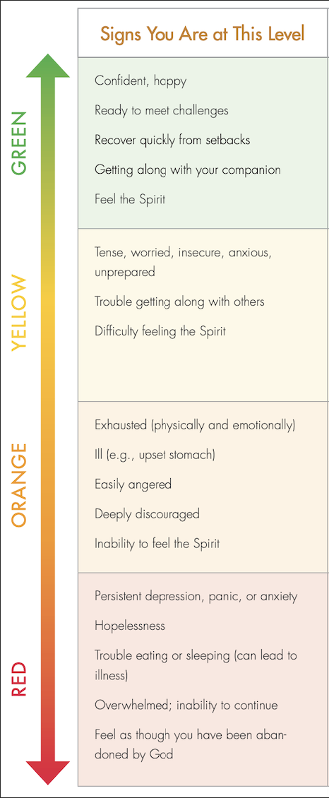

# Template for 1 : 1s

# Load Management:
> Where is your stress level (think about the image below)?
> Is there anything we need to discuss that might be preventing you from performing optimally? (i.e. recent illness of a loved one, financial stress, work overload)

# Reflection:
> What was difficult recently?
> What are you proud of recently?
> Is there anything you wish went better recently?

# Alignment:
> How confident do you feel where the organization is going?
> Do you have any questions about strategy?

# Growth & Goals:
> How are you tracking on your goals?
> What areas do you want to grow in more? How can I help?

# Relationships:
> How are things with your team (in a skip-level, manager, etc.)?
> What feedback do you have for me?

# Next Steps:
> Are there items we want to add to the reviewal for next time?
> Are there items we can add to your brag docs?

